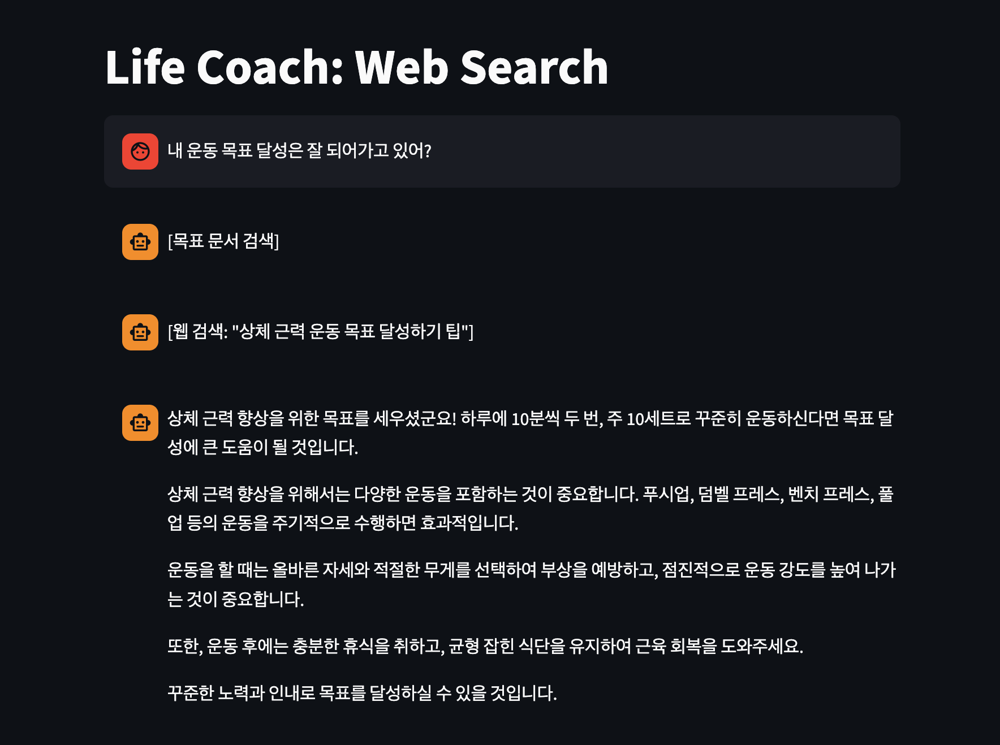

# Life Coach: Web Search, File Search

## Web Search

- Streamlit UI와 웹 검색 기능을 갖춘 Life Coach Agent의 기초를 구축하세요!
- Life Coach가 갖춰야 할 기능:
  - Streamlit으로 구축된 채팅 인터페이스
  - OpenAI Agents SDK 사용 (Agent + Runner)
  - 동기부여 콘텐츠, 자기 개발 팁, 습관 형성 조언을 검색하는 웹 검색 도구

### 1-1. Requirements

- [x] Streamlit으로 UI를 구현하세요 (st.chat_input, st.chat_message).
- [x] 코치가 대화를 기억하도록 세션 메모리를 구현하세요.
- [x] 에이전트가 관련 조언을 검색할 수 있는 웹 검색 도구를 추가하세요.
- [x] 에이전트는 유저를 격려하는 라이프 코치처럼 행동해야 합니다.

### 1-2. Example

```
User: 아침에 일찍 일어나고 싶은데 자꾸 알람을 끄게 돼
Coach: [웹 검색: "아침에 일찍 일어나는 팁"]
Coach: 좋은 목표네요! 효과가 검증된 방법들을 알려드릴게요: 1. 알람을 침대에서 먼 곳에 두세요...

User: 좋은 습관을 만들려면 어떻게 해야 해?
Coach: [웹 검색: "습관 만들기 기술"]
Coach: 가장 효과적인 방법은 "습관 쌓기(habit stacking)" 기법입니다...
```

## File Search

- Life Coach가 목표와 일기 항목을 기억할 수 있도록 파일 검색 기능을 추가하세요!
- Life Coach에 추가해야 할 기능:
  - 개인 목표 문서를 업로드하고 검색
  - 조언 시 과거 기록을 참조
  - 시간에 따른 진행 상황 추적

### Requirements

- [x] 개인 목표가 담긴 문서(PDF 또는 TXT)를 작성하세요.
- [x] 에이전트에 파일 검색 도구를 추가하세요.
- [x] 코치가 업로드된 목표를 참조하여 조언하도록 하세요.
- [x] 웹 검색과 결합하여 개인화된 추천을 제공하세요.

### Result



## 실행 방법

- **요구 사항:** Python 3.13 이상, [`uv`](https://docs.astral.sh/uv/) 권장
- **의존성 설치:** 프로젝트 루트에서 `uv sync`
- **앱 실행:**

  ```bash
  uv run streamlit run main.py
  ```

  브라우저에서 기본 주소는 `http://localhost:8501` 입니다.

- **환경 변수:** OpenAI API 키가 필요합니다. 프로젝트 루트에 `.env`를 두고 `OPENAI_API_KEY=...` 형태로 설정하세요 (`python-dotenv`로 로드).
- **대화 저장:** 세션은 기본적으로 `life-coach.db`(SQLite)에 쌓입니다.
